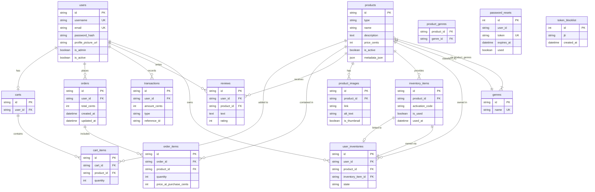

# LevelUp

A full-stack marketplace for buying and selling digital game keys. Browse a catalogue of games, manage a shopping cart, and complete purchases through Stripe. Includes an admin panel for product, inventory, and user management.

## Stack

- **Backend:** Flask, SQLAlchemy, Flask-JWT-Extended, Flask-Bcrypt, Flask-Mail, Stripe
- **Frontend:** React 19, Vite 8, React Router 7, Axios
- **Infrastructure:** Docker Compose

## Quick Start

```bash
cd levelup
make dev
```

Then open:

- Frontend: http://localhost:5173
- API: http://localhost:5000/api/v1

## Manual Setup

### Backend

```bash
cd levelup/backend
python -m venv .venv
source .venv/bin/activate
pip install -r requirements.txt
python run.py
```

### Frontend

```bash
cd levelup/frontend
npm install
npm run dev
```

## Environment Variables

Create a `.env` file in `levelup/backend/`:

```
SQLALCHEMY_DATABASE_URI="sqlite:///levelup.db"
SECRET_KEY="change-me"
JWT_SECRET_KEY="change-me-too"
FRONTEND_URL="http://localhost:5173"
STRIPE_SECRET_KEY="sk_test_..."
STRIPE_WEBHOOK_SECRET="whsec_..."
MAIL_USERNAME="you@example.com"
MAIL_PASSWORD="your-app-password"
```

## Make Commands

| Command           | Description                                    |
| ----------------- | ---------------------------------------------- |
| `make dev`      | Start backend and frontend in development mode |
| `make showcase` | Start with showcase mode (pre-seeded data)     |
| `make kill`     | Stop containers and remove volumes             |

## Frontend Pages

| Route | Page |
|-------|------|
| `/` | StorePage |
| `/products/:id` | GameDetailsPage |
| `/cart` | CartPage |
| `/login` | LoginPage |
| `/register` | RegisterPage |
| `/forgot-password` | ForgotPasswordPage |
| `/reset-password` | ResetPasswordPage |
| `/inventory` | InventoryPage |
| `/orders` | OrdersPage |
| `/success` | SuccessPage |
| `/admin` | AdminPage |

## Frontend Contexts

- `AuthContext` — authentication state and JWT handling
- `CartContext` — cart state management
- `ToastContext` — notification toasts

## API Routes

### Authentication

- `POST /api/v1/auth/register` — register (returns `access_token`, `refresh_token`)
- `POST /api/v1/auth/login` — login (returns `access_token`, `refresh_token`)
- `DELETE /api/v1/auth/logout` — logout (revokes token)
- `POST /api/v1/auth/refresh` — refresh access token
- `POST /api/v1/auth/forgot-password` — request password reset email
- `POST /api/v1/auth/reset-password` — reset password with token

### Products

- `GET /api/v1/products` — list products (supports `genre`, `type`, `price_min`, `price_max`, `search`, `sort`, `page`, `limit`)
- `GET /api/v1/products/<id>` — product details
- `GET /api/v1/products/<id>/reviews` — product reviews
- `GET /api/v1/products/steam-proxy/<steam_appid>` — proxy Steam app details
- `POST /api/v1/products` — create product (admin)
- `PATCH /api/v1/products/<id>` — update product (admin)
- `DELETE /api/v1/products/<id>` — soft delete product (admin)
- `POST /api/v1/products/<id>/images` — add product image (admin)
- `DELETE /api/v1/products/<id>/images/<image_id>` — delete product image (admin)
- `GET /api/v1/genres` — list genres
- `POST /api/v1/genres` — create genre (admin)

### Cart & Checkout

- `GET /api/v1/cart` — get user cart
- `POST /api/v1/cart/items` — add item to cart
- `DELETE /api/v1/cart/items/<product_id>` — remove item from cart
- `POST /api/v1/cart/checkout` — create Stripe checkout session
- `GET /api/v1/checkout/<session_id>/status` — poll payment status
- `POST /api/v1/payments/webhook` — Stripe webhook handler

### Orders

- `GET /api/v1/orders` — get order history
- `PATCH /api/v1/orders/<order_id>` — cancel pending order

### Inventory

- `GET /api/v1/inventory` — get user inventory
- `GET /api/v1/inventory/<item_id>` — get inventory item
- `GET /api/v1/inventory/<item_id>/activate` — activate key

### Users

- `GET /api/v1/users/me` — get current user profile
- `PUT /api/v1/users/me` — update current user profile
- `DELETE /api/v1/users/me` — delete current user account

### Admin

- `GET /api/v1/admin/users` — list all users
- `GET /api/v1/admin/users/<user_id>` — get user details
- `PUT /api/v1/admin/users/<user_id>` — update user (admin fields)
- `DELETE /api/v1/admin/users/<user_id>` — delete user
- `GET /api/v1/admin/stats` — get platform statistics
- `POST /api/v1/admin/products/<id>/activation-keys` — generate activation keys

## Architecture

### Backend

LevelUp follows a layered Flask architecture:

- **App factory** — `create_app()` in `app/__init__.py` initializes extensions (SQLAlchemy, Bcrypt, JWT, Mail) and registers the API blueprint.
- **API layer** — `app/api/v1/` contains route blueprints (auth, products, cart, orders, payments, inventory, admin, users).
- **Service layer** — `app/services/` holds business logic (cart, inventory, order, payment, and Stripe integration).
- **Persistence layer** — `app/persistence/repository.py` implements the repository pattern with a base `Repository` class and specialized repositories (User, Product, Order, etc.).
- **Models** — `app/models/` defines SQLAlchemy entities and their relationships.

### Frontend

The frontend is a React SPA built with Vite and React Router:

- **API client** — `src/api/` centralizes Axios calls and interceptors (JWT injection, error handling).
- **Context** — `src/context/` provides React contexts (e.g., `AuthContext`).
- **Pages** — `src/pages/` contains route-level views (Catalogue, Product Page, Cart, Login, Admin).
- **Components** — `src/components/` holds reusable UI blocks (cards, forms, modals, admin modules).

### Data Flow

```
Browser
  │
  ▼
React Router
  │
  ├─► Context (Auth)
  │
  ├─► API Client (Axios + JWT)
  │     │
  │     ▼
  │   Flask API (v1)
  │     │
  │     ├─► Routes (views)
  │     │     │
  │     │     ▼
  │     │   Services (business logic)
  │     │     │
  │     │     ▼
  │     │   Repository (CRUD)
  │     │     │
  │     │     ▼
  │     │   SQLAlchemy Models
  │     │     │
  │     │     ▼
  │     │   SQLite / PostgreSQL
  │     │
  │     └─► Stripe Webhook / Session
  │
  └─► UI components (render state)
```

## Database Diagram



## License

Built for the Holberton Portfolio Project.
