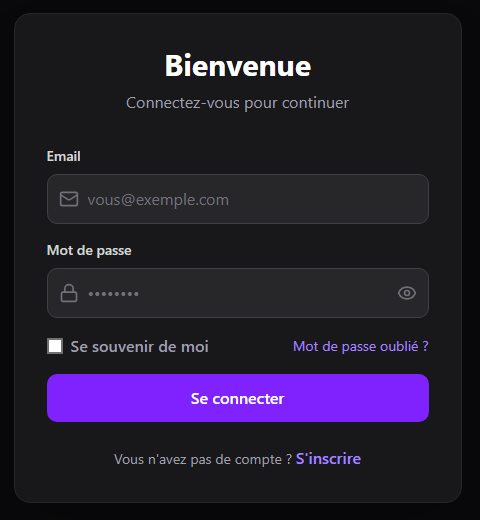
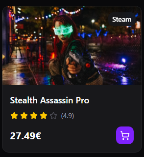
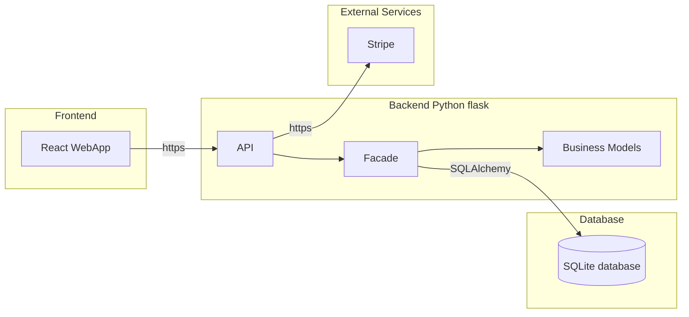
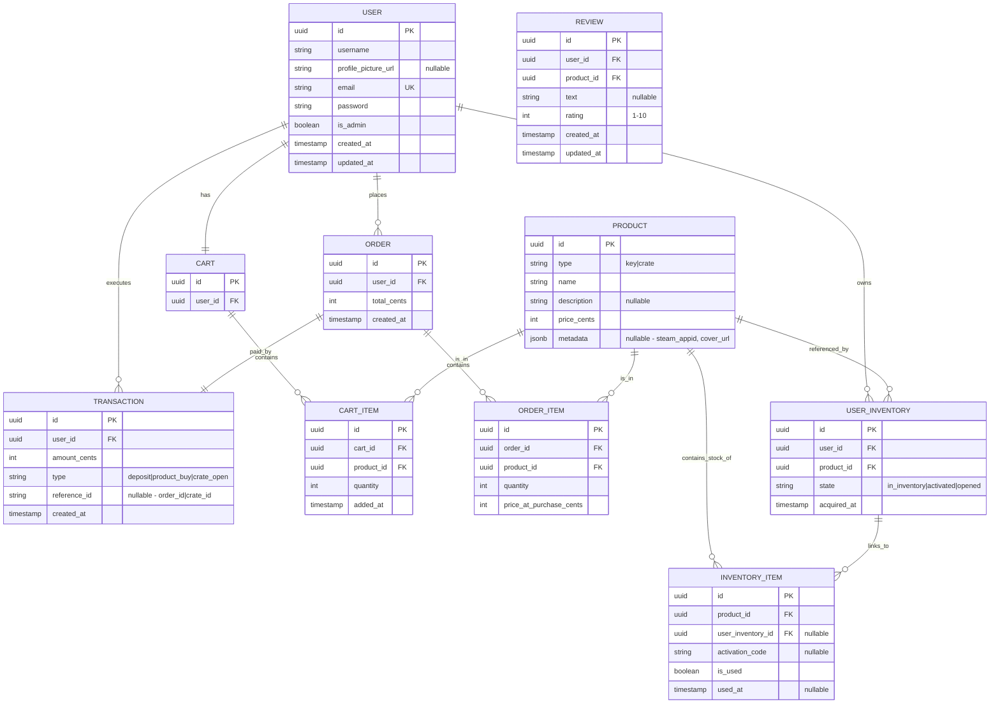
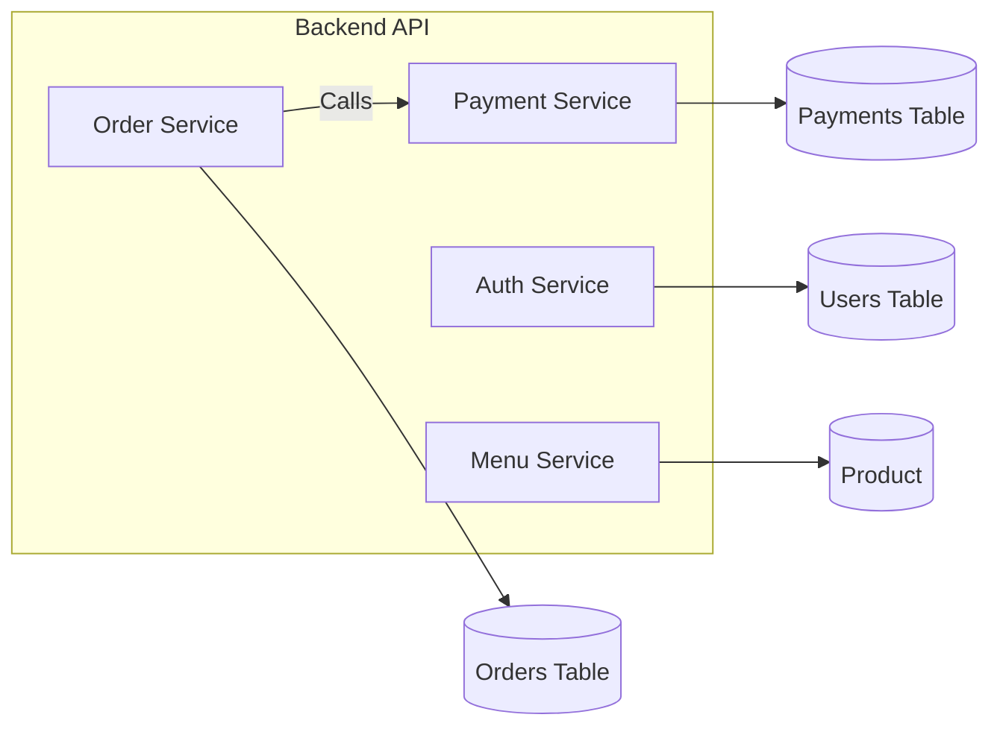

# LEVELUP - Technical Documentation

This documentation aims to provide a clear and structured vision for the MVP development process. It helps anticipate technical requirements, organize source control and quality assurance practices, reduce risks, improve collaboration, and align all stakeholders on the project’s technical direction.

## 1 User Stories and mockups

### Must Have

- As a normal user, I want to create an account, so that allow me to register.
- As a normal user, I want to delete an account, so that allow me to remove my personal information.
- As a normal user, I want to reset my password, so that allow me recover my account.
- As a normal user, I want see all the buyable product, so that allow me to discover them.
- As a normal user, I want buy my product on a website, so that save me from having to travel.
- As a normal user, I want to get a buying summary, so that allow me get all needed information like commande id and key.
- As a normal user, I want a responsive website, so that allow me to use it from different device.
- As an admin user, I want to check key status, so that allow to keep an eye on storage.
- As an admin user, I want to add/delete/update product card, so that allow me to perform CRUD operation.

### Should Have

- As a normal user, I want a user page so that allow me to see my favorite and buying historic once connected.
- As a normal user, I want a filter so that allow me to get faster the kind of thing i'm looking for.
- As a normal user, I want a good UI so that allow me to navigate faster and easier.
- As a normal user, I want a dark mode so that allow me a better accessibility.
- As a normal user, I want to note and add a comment if wanted so that allow me to share my experience.
- As an admin user, I want to check buying historic overall and by id, so that allow me to help a customer if needed.

### Could Have

- As a normal user, I want to update my profil information so that allow me to update username, profilpicture, user description. 
- As a normal user, I want to add friend so that allow me to see their own favorite.
- As a normal user, I want to gamble so that give me a chance to get a better key.
### Won't Have

- no promotion code
- multi language
- no loyalty points

## Mockups

<table>
  <tr>
    <td></td>
    <td></td>
  </tr>
</table>

## Design System Architecture

## 2 Components, Classes and Database design

### 2.1 Front-end components

This table summarizes the pages and components to define the UI scope and clarify major interactions.

| Component / Page   | Type        | Purpose                                                                 |
|--------------------|-------------|-------------------------------------------------------------------------|
| `HomePage`         | Page        | Main page with popular game                                            |
| `Card`             | Page        | Displays card with optional filter                                     |
| `LoginPage`        | Page        | User login with email and password                                     |
| `RegisterPage`     | Page        | User can create an account                                             |
| `AdminDashboard`   | Page        | Panel to manage website                                                |
| `Cart`             | Page        | Check added game and purchase                                          |
| `Filter`           | UI Component| Filter game                                                            |
| `Card`             | UI Component| Game picture with price                                                |
| `Cart`             | UI Component| Shopping cart                                                          |
| `AdminPanel`       | UI Component| add/delete/update game card                                            |
| `Header`           | UI Component| Login, navigation links, Logo                                          |

**Interactions :**

- Register/login -> Use /auth route API from backend
- Admin add card -> Call "PUT" method from backend API
- Filter -> Check all item category id and only display the one filter

### 2.2 Database diagram (ER)

This ER diagram helps visualize entities and relationships to validate keys and the data structure.

### 2.3 Back-end classes

This flowchart shows service separation and dependencies to validate flows and responsibilities.

