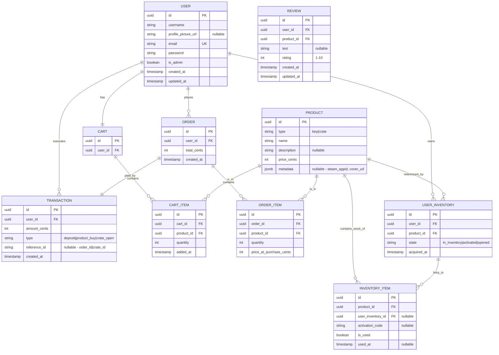

```mermaid
erDiagram
    direction TB

    USER {
        uuid id PK
        string username
        string profile_picture_url "nullable"
        string email UK
        string password
        boolean is_admin
        timestamp created_at
        timestamp updated_at
    }

    REVIEW {
        uuid id PK
        uuid user_id FK
        uuid product_id FK
        string text "nullable"
        int rating "1-10"
        timestamp created_at
        timestamp updated_at
    }

    TRANSACTION {
        uuid id PK
        uuid user_id FK
        int amount_cents
        string type "deposit|product_buy|crate_open"
        string reference_id "nullable - order_id|crate_id"
        timestamp created_at
    }

    PRODUCT {
        uuid id PK
        string type "key|crate"
        string name
        string description "nullable"
        int price_cents
        jsonb metadata "nullable - steam_appid, cover_url"
    }

    CART {
        uuid id PK
        uuid user_id FK
    }

    CART_ITEM {
        uuid id PK
        uuid cart_id FK
        uuid product_id FK
        int quantity
        timestamp added_at
    }

    ORDER {
        uuid id PK
        uuid user_id FK
        int total_cents
        timestamp created_at
    }

    ORDER_ITEM {
        uuid id PK
        uuid order_id FK
        uuid product_id FK
        int quantity
        int price_at_purchase_cents
    }

    USER_INVENTORY {
        uuid id PK
        uuid user_id FK
        uuid product_id FK
        string state "in_inventory|activated|opened"
        timestamp acquired_at
    }

    INVENTORY_ITEM {
        uuid id PK
        uuid product_id FK
        uuid user_inventory_id FK "nullable"
        string activation_code "nullable"
        boolean is_used
        timestamp used_at "nullable"
    }

    USER ||--|| CART : "has"
    USER ||--o{ ORDER : "places"
    USER ||--o{ USER_INVENTORY : "owns"
    USER ||--o{ TRANSACTION : "executes"
    
    CART ||--o{ CART_ITEM : "contains"
    PRODUCT ||--o{ CART_ITEM : "is_in"
    
    ORDER ||--o{ ORDER_ITEM : "contains"
    PRODUCT ||--o{ ORDER_ITEM : "is_in"
    ORDER ||--|| TRANSACTION : "paid_by"
    
    PRODUCT ||--o{ USER_INVENTORY : "referenced_by"
    PRODUCT ||--o{ INVENTORY_ITEM : "contains_stock_of"
    USER_INVENTORY ||--o{ INVENTORY_ITEM : "links_to"
```