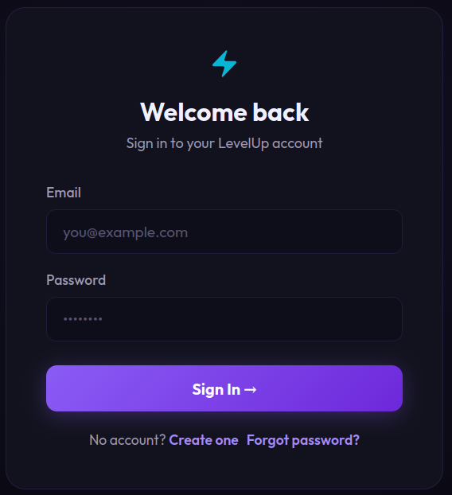
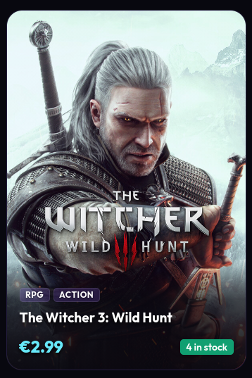
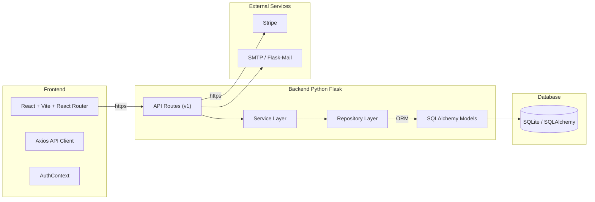
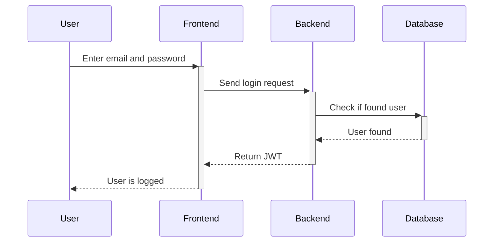
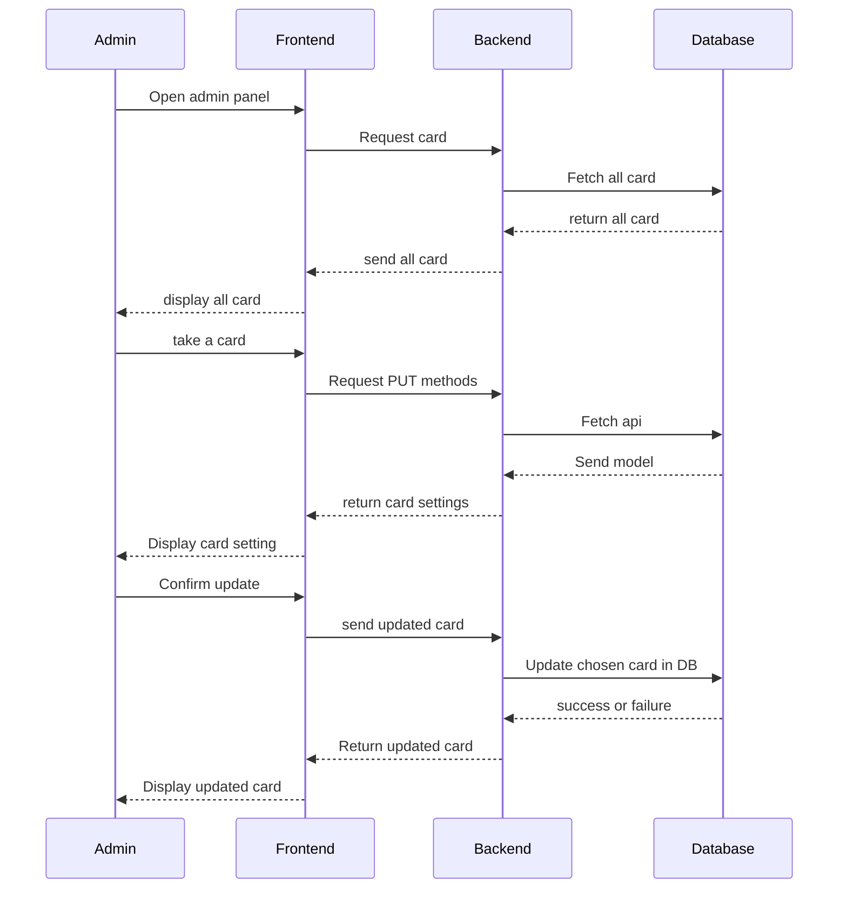
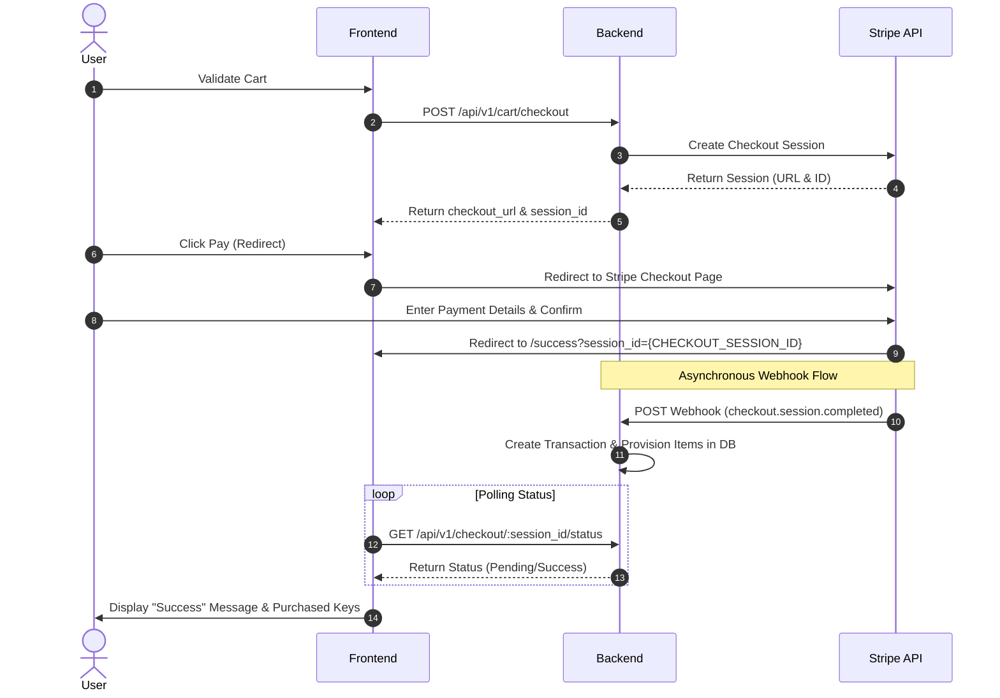

# LEVELUP - Technical Documentation

This documentation aims to provide a clear and structured vision for the MVP development process. It helps anticipate technical requirements, organize source control and quality assurance practices, reduce risks, improve collaboration, and align all stakeholders on the project’s technical direction.


## 1 User Stories and mockups

### Must Have

- As a normal user, I want to create an account, so that allow me to register.
- As a normal user, I want to delete an account, so that allow me to remove my personal information.
- As a normal user, I want to reset my password, so that allow me recover my account.
- As a normal user, I want see all the buyable product, so that allow me to discover them.
- As a normal user, I want buy my product on a website, so that save me from having to travel.
- As a normal user, I want to get a buying summary, so that allow me get all needed information like order id and key.
- As a normal user, I want a responsive website, so that allow me to use it from different device.
- As an admin user, I want to check key status, so that allow to keep an eye on storage.
- As an admin user, I want to add/delete/update product card, so that allow me to perform CRUD operation.

### Should Have

- As a normal user, I want a user page so that allow me to see my favorite and purchase history once connected.
- As a normal user, I want a filter so that allow me to get faster the kind of thing i'm looking for.
- As a normal user, I want a good UI so that allow me to navigate faster and easier.
- As a normal user, I want a dark mode so that allow me a better accessibility.
- As a normal user, I want to note and add a comment if wanted so that allow me to share my experience.
- As an admin user, I want to check purchase history overall and by id, so that allow me to help a customer if needed.

### Could Have

- As a normal user, I want to update my profile information so that allow me to update username, profile picture, user description. 
- As a normal user, I want to add friend so that allow me to see their own favorite.
- As a normal user, I want to gamble so that give me a chance to get a better key.
### Won't Have

- no promotion code
- multi language
- no loyalty points

## Mockups

<table>
  <tr>
    <td></td>
    <td></td>
  </tr>
</table>

## Design System Architecture



## 2 Components, Classes and Database design

### 2.1 Front-end components

This table summarizes the pages and components to define the UI scope and clarify major interactions.

| Component / Page        | Type         | Purpose                                                                 |
| ---------------------- | ------------ | ----------------------------------------------------------------------- |
| `StorePage`            | Page         | Main catalogue with search, filters, and sorting                        |
| `GameDetailsPage`      | Page         | Detailed product view with add-to-cart and quantity selection           |
| `CartPage`             | Page         | Review cart items and initiate checkout                                 |
| `LoginPage`            | Page         | User login with email and password                                      |
| `RegisterPage`         | Page         | Create a new account                                                   |
| `ForgotPasswordPage`   | Page         | Request password reset email                                            |
| `ResetPasswordPage`    | Page         | Confirm password reset with token                                       |
| `InventoryPage`        | Page         | View purchased keys and activate them                                   |
| `OrdersPage`           | Page         | View order history and cancel pending orders                            |
| `SuccessPage`          | Page         | Checkout success confirmation                                           |
| `AdminPage`            | Page         | Manage products, inventory keys, and users                              |
| `Header`               | UI Component | Navigation, login state, cart badge                                     |
| `ProductCard`          | UI Component | Game card with thumbnail, price, and genres                             |
| `CartItem`             | UI Component | Cart row with quantity controls and remove action                      |
| `GenreFilter`          | UI Component | Sidebar or dropdown to filter catalogue by genre                       |
| `AdminProductForm`     | UI Component | Create or edit a product (admin only)                                  |
| `AdminKeyManager`      | UI Component | Generate and assign activation keys (admin only)                       |

**Interactions :**

- Register/login -> `POST /api/v1/auth/register` and `/api/v1/auth/login`
- Admin add product -> `POST /api/v1/products` and `/api/v1/genres`
- Cart add -> `POST /api/v1/cart/items`
- Checkout -> `POST /api/v1/cart/checkout` -> Stripe redirect -> webhook
- Inventory activation -> `GET /api/v1/inventory/<id>/activate`
- Order cancellation -> `PATCH /api/v1/orders/<id>`
- Password reset -> `POST /api/v1/auth/forgot-password` + `POST /api/v1/auth/reset-password`

### 2.2 Database diagram (ER)

This ER diagram reflects the actual SQLAlchemy models used in the application.

```mermaid
erDiagram
    direction TB

    USER {
        string id PK
        string username UK
        string email UK
        string password_hash
        string profile_picture_url "nullable"
        boolean is_admin
        boolean is_active
        timestamp created_at
        timestamp updated_at
    }

    GENRE {
        string id PK
        string name UK
    }

    PRODUCT_GENRES {
        string product_id FK
        string genre_id FK
    }

    PRODUCT {
        string id PK
        string type "key|crate"
        string name
        text description "nullable"
        int price_cents
        json metadata_json "nullable"
        boolean is_active
        timestamp created_at
        timestamp updated_at
    }

    PRODUCT_IMAGE {
        string id PK
        string product_id FK
        string link
        string alt_text "nullable"
        boolean is_thumbnail
    }

    CART {
        string id PK
        string user_id FK
    }

    CART_ITEM {
        string id PK
        string cart_id FK
        string product_id FK
        int quantity
    }

    ORDER {
        string id PK
        string user_id FK
        int total_cents
        timestamp created_at
        timestamp updated_at
    }

    ORDER_ITEM {
        string id PK
        string order_id FK
        string product_id FK
        int quantity
        int price_at_purchase_cents
    }

    REVIEW {
        string id PK
        string user_id FK
        string product_id FK
        text text "nullable"
        int rating
        timestamp created_at
        timestamp updated_at
    }

    INVENTORY_ITEM {
        string id PK
        string product_id FK
        string activation_code "nullable"
        boolean is_used
        datetime used_at "nullable"
    }

    USER_INVENTORY {
        string id PK
        string user_id FK
        string product_id FK
        string inventory_item_id FK "nullable"
        string state "in_inventory|activated|opened"
    }

    TRANSACTION {
        string id PK
        string user_id FK
        int amount_cents
        string type
        string reference_id "nullable"
    }

    PASSWORD_RESET {
        int id PK
        string user_id
        string token UK
        datetime expires_at
        boolean used
    }

    TOKEN_BLOCKLIST {
        int id PK
        string jti
        datetime created_at
    }

    USER ||--o| CART : "has"
    USER ||--o{ ORDERS : "places"
    USER ||--o{ REVIEWS : "writes"
    USER ||--o{ TRANSACTIONS : "records"
    USER ||--o{ USER_INVENTORIES : "owns"

    PRODUCT ||--o{ CART_ITEMS : "in"
    PRODUCT ||--o{ ORDER_ITEMS : "in"
    PRODUCT ||--o{ REVIEWS : "receives"
    PRODUCT ||--o{ PRODUCT_IMAGES : "has"
    PRODUCT ||--o{ INVENTORY_ITEMS : "provides"
    PRODUCT ||--o{ USER_INVENTORIES : "referenced_by"
    PRODUCT }|--|{ GENRES : "classified_by"

    CART ||--o{ CART_ITEMS : "contains"
    ORDER ||--o{ ORDER_ITEMS : "includes"
    INVENTORY_ITEM ||--o| USER_INVENTORY : "linked_to"
```



### 2.3 Back-end architecture

This flowchart shows the actual layered architecture: API routes, services, repository pattern, and SQLAlchemy models.

```mermaid
graph LR
    subgraph API["API Layer"]
        AuthRoutes["auth.py"]
        ProductRoutes["products.py"]
        CartRoutes["cart.py"]
        OrderRoutes["orders.py"]
        PaymentRoutes["payments.py"]
        InventoryRoutes["inventory.py"]
        AdminRoutes["admin.py"]
        UserRoutes["users.py"]
    end

    subgraph Services["Service Layer"]
        CartService["cart_service.py"]
        OrderService["order_service.py"]
        PaymentService["payment_service.py"]
        StripeService["stripe_service.py"]
        InventoryService["inventory_service.py"]
    end

    subgraph Persistence["Persistence Layer"]
        Repository["Repository (generic)"]
        CartRepo["CartRepository"]
        ProductRepo["ProductRepository"]
        OrderRepo["OrderRepository"]
        UserRepo["UserRepository"]
        UserInventoryRepo["UserInventoryRepository"]
        TransactionRepo["TransactionRepository"]
    end

    subgraph Models["SQLAlchemy Models"]
        UserModel["User"]
        ProductModel["Product"]
        CartModel["Cart / CartItem"]
        OrderModel["Order / OrderItem"]
        InventoryModel["UserInventory / InventoryItem"]
        ReviewModel["Review"]
        TransactionModel["Transaction"]
        GenreModel["Genre / product_genres"]
        ImageModel["ProductImage"]
        TokenModel["TokenBlocklist"]
        PasswordModel["PasswordReset"]
    end

    subgraph External["External"]
        Stripe["Stripe API"]
        Mail["SMTP / Flask-Mail"]
    end

    AuthRoutes --> Services
    ProductRoutes --> Services
    CartRoutes --> Services
    OrderRoutes --> Services
    PaymentRoutes --> Services
    InventoryRoutes --> Services
    AdminRoutes --> Services
    UserRoutes --> Services

    Services --> Persistence
    Persistence --> Models

    PaymentRoutes --> Stripe
    AuthRoutes --> Mail
```



## 3 High-Level Sequence Diagrams

### 3.1 Auth diagram

This sequence diagram summarizes the login flow and how the JWT is issued back to the client.



### 3.2 Update card diagram

This sequence diagram outlines the admin update-card flow from listing cards to saving changes.



### 3.3 Purchase diagram

This sequence diagram captures the checkout flow, including the Stripe Checkout Session redirect, webhook processing, and status polling.




## 4 API

### 4.1 AUTH

- **POST /api/v1/auth/register**

Register a new user.

```json
input
{
    "username": "string",
    "email": "string",
    "password": "string"
}
output
{
    "message": "user created successfully",
    "access_token": "jwt_token",
    "refresh_token": "jwt_token",
    "user": {
        "id": "uuid",
        "username": "string",
        "email": "string"
    }
}
```

- **POST /api/v1/auth/login**

Login and receive JWT pair.

```json
input
{
    "email": "string",
    "password": "string"
}
output
{
    "access_token": "jwt_token",
    "refresh_token": "jwt_token",
    "user": {
        "id": "uuid",
        "username": "string",
        "email": "string"
    }
}
```

- **DELETE /api/v1/auth/logout** *(JWT required)*

Invalidate the current JWT.

```json
output
{
    "message": "logged out"
}
```

- **POST /api/v1/auth/refresh** *(JWT refresh required)*

Refresh access token.

```json
output
{
    "access_token": "jwt_token"
}
```

- **POST /api/v1/auth/forgot-password**

Request a password reset email.

```json
input
{
    "email": "string"
}
output
{
    "message": "if this email exists, a reset link has been sent"
}
```

- **POST /api/v1/auth/reset-password**

Reset password using a token.

```json
input
{
    "token": "string",
    "password": "string"
}
output
{
    "message": "password reset successfully"
}
```

### 4.2 PRODUCTS

- **GET /api/v1/products**

Browse the store with filters.

Query params: `genre=string&type=string&price_min=float&price_max=float&search=string&sort=string&page=int&limit=int`

```json
output
{
    "products": [
        {
            "id": "uuid",
            "product_name": "string",
            "product_id": "uuid",
            "product_thumbnail_link": "string",
            "product_genres": ["uuid"],
            "price": "float",
            "type": "key|crate",
            "stock": "int"
        }
    ]
}
```

- **GET /api/v1/products/<product_id>**

Get details for one product.

```json
output
{
    "product": {
        "id": "uuid",
        "product_name": "string",
        "description": "text",
        "price": "float",
        "type": "key|crate",
        "product_thumbnail_link": "string",
        "product_genres": [
            {"id": "uuid", "name": "string"}
        ],
        "product_images": [
            {"id": "uuid", "link": "string", "alt": "string", "is_thumbnail": "boolean"}
        ],
        "stock": "int",
        "steam_appid": "string|null"
    }
}
```

- **GET /api/v1/products/<product_id>/reviews**

Get all reviews for a product.

```json
output
{
    "reviews": [
        {
            "id": "uuid",
            "user_id": "uuid",
            "product_id": "uuid",
            "text": "string",
            "rating": "int"
        }
    ]
}
```

- **GET /api/v1/products/steam-proxy/<steam_appid>**

Proxy Steam app details (bypasses CORS).

```json
output
Steam API JSON response
```

- **POST /api/v1/products** *(Admin Only)*

Create a product.

```json
input
{
    "product_name": "string",
    "description": "text",
    "price": "float",
    "type": "key|crate",
    "steam_appid": "string",
    "genres": ["string"],
    "product_thumbnail_link": "string",
    "product_images": [
        {"link": "string", "alt": "string"}
    ],
    "is_active": "boolean"
}
output
{
    "product_id": "uuid"
}
```

- **PATCH /api/v1/products/<product_id>** *(Admin Only)*

Update a product.

```json
input
{
    "product_name": "string",
    "description": "text",
    "price": "float",
    "type": "key|crate",
    "genres": ["string"],
    "steam_appid": "string",
    "product_thumbnail_link": "string",
    "is_active": "boolean"
}
output
{
    "message": "Successfully updated"
}
```

- **DELETE /api/v1/products/<product_id>** *(Admin Only)*

Soft delete a product.

```json
output
{
    "message": "Product deleted"
}
```

- **POST /api/v1/products/<product_id>/images** *(Admin Only)*

Add an image to a product.

```json
input
{
    "link": "string",
    "alt": "string"
}
output
{
    "image": {
        "id": "uuid",
        "link": "string",
        "alt_text": "string",
        "is_thumbnail": "boolean"
    }
}
```

- **DELETE /api/v1/products/<product_id>/images/<image_id>** *(Admin Only)*

Remove an image from a product.

```json
output
{
    "message": "Image deleted"
}
```

- **GET /api/v1/genres**

List all genres.

```json
output
{
    "genres": [
        {"id": "uuid", "name": "string"}
    ]
}
```

- **POST /api/v1/genres** *(Admin Only)*

Create a genre.

```json
input
{
    "name": "string"
}
output
{
    "genre": {"id": "uuid", "name": "string"}
}
```

### 4.3 CART

- **GET /api/v1/cart** *(JWT required)*

Get the current user's cart.

```json
output
{
    "id": "uuid",
    "user_id": "uuid",
    "items": [
        {
            "id": "uuid",
            "product_id": "uuid",
            "quantity": "int",
            "product_name": "string",
            "price": "float",
            "product_thumbnail_link": "string",
            "product_thumbnail_alt": "string",
            "product_genres": [
                {"id": "uuid", "name": "string"}
            ],
            "stock": "int",
            "steam_appid": "string|null"
        }
    ]
}
```

- **POST /api/v1/cart/items** *(JWT required)*

Add a product to the cart.

```json
input
{
    "product_id": "uuid",
    "quantity": "int"
}
output
{
    "id": "uuid",
    "user_id": "uuid",
    "items": [ ... ]
}
```

- **DELETE /api/v1/cart/items/<product_id>** *(JWT required)*

Remove a product from the cart.

```json
output
{
    "id": "uuid",
    "user_id": "uuid",
    "items": [ ... ]
}
```

### 4.4 ORDERS

- **POST /api/v1/cart/checkout** *(JWT required)*

Create a Stripe Checkout Session.

```json
output
{
    "checkout_url": "string",
    "session_id": "string"
}
```

- **GET /api/v1/checkout/<session_id>/status** *(JWT required)*

Poll the payment and fulfillment status.

```json
output
{
    "success": "boolean",
    "payment_status": "string",
    "fulfillment": {
        "items_provisioned": "boolean"
    }
}
```

- **GET /api/v1/orders** *(JWT required)*

Get order history (paginated).

```json
output
[
    {
        "id": "uuid",
        "user_id": "uuid",
        "total": "float",
        "total_cents": "int",
        "items": [
            {
                "id": "uuid",
                "product_id": "uuid",
                "product_name": "string",
                "quantity": "int",
                "price_at_purchase": "float",
                "product_thumbnail_link": "string",
                "product_thumbnail_alt": "string",
                "product_genres": [
                    {"id": "uuid", "name": "string"}
                ],
                "steam_appid": "string|null"
            }
        ]
    }
]
```

- **PATCH /api/v1/orders/<order_id>** *(JWT required)*

Cancel a pending order.

```json
input
{
    "payment_status": "cancelled"
}
output
{
    "id": "uuid",
    "payment_status": "cancelled",
    ...
}
```

### 4.5 INVENTORY

- **GET /api/v1/inventory** *(JWT required)*

Get the current user's inventory (paginated).

```json
output
[
    {
        "id": "uuid",
        "product_id": "uuid",
        "state": "in_inventory|activated|opened",
        "product_details": {
            "id": "uuid",
            "product_name": "string",
            "price": "float",
            "product_thumbnail_link": "string",
            "product_images": ["object"]
        },
        "details": {
            "id": "uuid",
            "activation_code": "string|null",
            "is_used": "boolean",
            "used_at": "datetime|null"
        }
    }
]
```

- **GET /api/v1/inventory/<item_id>** *(JWT required)*

Get a single inventory item.

```json
output
{
    "id": "uuid",
    "product_id": "uuid",
    "state": "in_inventory|activated|opened",
    "product_details": { ... },
    "details": { ... }
}
```

- **GET /api/v1/inventory/<item_id>/activate** *(JWT required)*

Activate an inventory item to reveal its code.

```json
output
{
    "metadata": {
        "id": "uuid",
        "activation_code": "string",
        "is_used": "boolean",
        "used_at": "datetime|null"
    }
}
```

### 4.6 PAYMENTS

- **POST /api/v1/payments/webhook**

Stripe webhook endpoint (public, no JWT).

Handles `checkout.session.completed` and `checkout.session.expired` events. Provisions inventory items and creates transactions automatically.

### 4.7 USERS

- **GET /api/v1/users/me** *(JWT required)*

Get current user profile.

```json
output
{
    "id": "uuid",
    "username": "string",
    "email": "string"
}
```

- **PUT /api/v1/users/me** *(JWT required)*

Update current user profile.

```json
input
{
    "username": "string",
    "email": "string"
}
output
{
    "id": "uuid",
    "username": "string",
    "email": "string"
}
```

- **DELETE /api/v1/users/me** *(JWT required)*

Delete current user account.

```json
output
{
    "message": "user deleted"
}
```

### 4.8 ADMIN

- **GET /api/v1/admin/users** *(JWT + Admin required)*

List all users.

```json
output
[
    {
        "id": "uuid",
        "username": "string",
        "email": "string",
        "profile_picture_url": "string|null",
        "is_admin": "boolean",
        "is_active": "boolean"
    }
]
```

- **GET /api/v1/admin/users/<user_id>** *(JWT + Admin required)*

Get single user details.

```json
output
{
    "id": "uuid",
    "username": "string",
    "email": "string",
    "profile_picture_url": "string|null",
    "is_admin": "boolean",
    "is_active": "boolean"
}
```

- **PUT /api/v1/admin/users/<user_id>** *(JWT + Admin required)*

Update user fields (admin only).

```json
input
{
    "username": "string",
    "email": "string",
    "is_admin": "boolean",
    "is_active": "boolean"
}
output
{
    "id": "uuid",
    "username": "string",
    "email": "string",
    "is_admin": "boolean",
    "is_active": "boolean"
}
```

- **DELETE /api/v1/admin/users/<user_id>** *(JWT + Admin required)*

Delete a user and cascade related data.

```json
output
{
    "message": "user deleted"
}
```

- **GET /api/v1/admin/stats** *(JWT + Admin required)*

Get platform statistics.

```json
output
{
    "total_users": "int",
    "total_admins": "int",
    "total_active": "int",
    "total_inactive:": "int"
}
```

- **POST /api/v1/admin/products/<product_id>/activation-keys** *(Admin Only)*

Generate activation keys for a product.

```json
input
{
    "quantity": "int",
    "activation_code": "string"
}
output
{
    "activation_items": [
        {
            "id": "uuid",
            "activation_code": "string",
            "is_used": "boolean",
            "used_at": "datetime|null"
        }
    ]
}
```

## 5 Plan SCM and QA Strategies

### 5.1 SCM Processes (Source Control Management)

Git is the version control tool used with the following major branches:

- `main` — production-ready code
- `dev` — integration branch for testing before merging to main
- `feature/*` — individual features allocated per developer

**Commit convention:** `feat`, `fix`, `update`, etc.

### 5.2 Quality assurance (QA)

**Testing strategy:**

- API tests — validate endpoints with Bruno
- Unit tests — cover Flask routes and critical frontend flows

**Tools:**

- `oxlint` — frontend linting
- `Bruno` — API testing
- `pytest` — Python backend tests

**Deployment pipeline:**

- Development — local Docker Compose (`make dev`)
- Showcase — seeded data mode (`make showcase`)
- Production — containerized deployment with build artifacts
